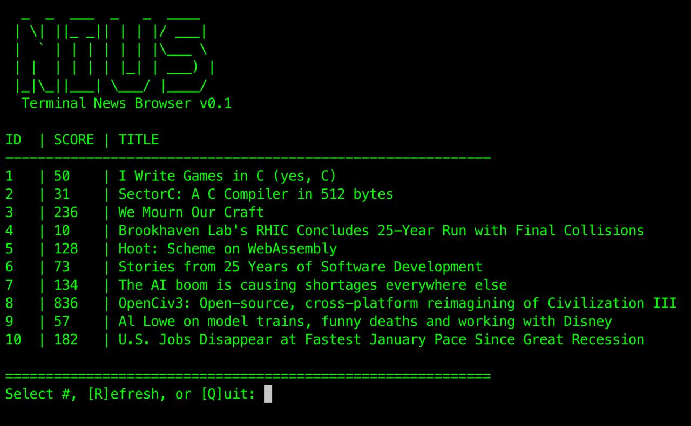

[](https://www.gnu.org/licenses/old-licenses/gpl-2.0.en.html)


[](https://github.com/nomagev/nius/actions/workflows/python-tests.yml)

# NIUS.py
> A minimalist, terminal-based Hacker News browser for the distraction-free developer.

Nius.py (pronounced "News PY") is a lightweight Python utility designed to browse Hacker News headers and comments directly from your terminal. No heavy UX, no tracking—just the data.



## Requirements

### System

* **Operating System**: Unix-like (macOS or Linux). 
  > *Note: Windows users will need WSL (Windows Subsystem for Linux) as the terminal 'raw mode' requires `termios`.*
* **Python**: Version 3.10 or higher.

### Python Libraries
Nius is designed to be lightweight. It relies on the following:
* `requests`: For fetching live data from the Hacker News API.
* `Standard Library`: Uses built-in modules (`os`, `sys`, `time`, `html`, `tty`, `termios`)—no extra installation required for these.

## Quick Start

1. **Clone and Enter:**
   ```bash
   git clone [https://github.com/nomagev/nius.git](https://github.com/nomagev/nius.git)
   cd nius

2. **Run Setup: This script creates a virtual environment and installs all dependencies.**
    ```bash
    chmod +x setup.sh
    ./setup.sh

3. **Launch:**
    ```bash
    ./run.sh

## Features
- **Cinematic Rendering:** Text is written in real-time with a "typewriter" effect.
- **Keyboard Driven:** Use `ESC` for next comment and `B` for back.
- **Single-Key Navigation:** Use `ESC` for next and `B` for back.
- **Markdown-Lite:** Cleans HN HTML into terminal text.

## Controls
- `[Number]`: Select story
- `[ESC]`: Next comment
- `[B]`: Back to feed
- `[Q]`: Quit

## License
GNU GPL v2.0